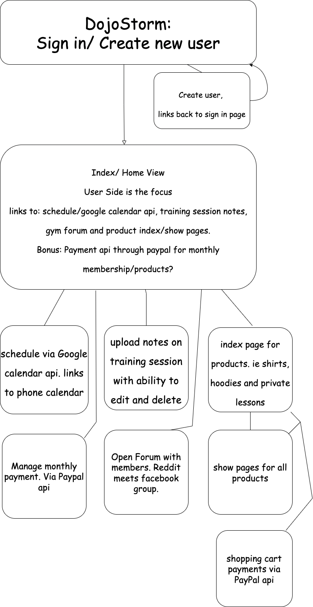

# DojoStorm
__________________________________________________
Meet DojoStorm: Your new Jiu Jitsu Gym Manager.
__________________________________________________
DojoStorm is a fullstack application for Brazilian Jiu Jitsu gyms. 
__________________________________________________
Think of DojoStorm as a CRM, a Social App and an online store all in one. DojoStorm will give you the ability to see all of your members in one place, you can upload documents into their user profile, bill them for services, create/edit/delete users etc. 
__________________________________________________
With DojoStorm, you will be able to: automate monthly billing, push gym announcements (eg. upcoming seminars or belt promotions), update your schedule and much more.

__________________________________________________
DojoStorm boasts an aesthetic social app on the user side. There is a open forum section and the ability to post 
public threads as well as direct message other users. 
Users will be able to log in and see upcoming events, manage thier monthly payment,
see technique videos posted by you, ask upperbelts questions and finally a fully intergrated e commerce site to allow you
to sell your gyms merchandise online. 
__________________________________________________

DojoStorm will offer full CRUD functionality in the FORUM, Google API calendar and Training Session Note features.
__________________________________________________
DojoStorm uses google calendar's api so that users can sync your scheduled classes and events right to thier phone calendar app. DojoStorm also handles payment
through the paypal api. 
__________________________________________________

Technologies Used:
HTML/CSS
JavaScript
Node.js 
express
liquid html 
mongoDB
mongoose

__________________________________________________

current version announcements: 

I hit the minimum viable requirements for the project but not for what I want this to be.
This is a full CRUD app that is connected to a database and will be deployed eventually. 

-Road Blocks: I was able to fetch api data and see the data console logged, but unable to store/ use that data. I spent way too many hours on this part alone. I used two days learning how to not use the apis. 

-I do not have a functional cart yet. 

-I spent so much time on the api that I did nothing with the social aspect of the page. This will be added later. 

## Author

- [@dbic](https://www.github.com/idbic)

## Wireframe

